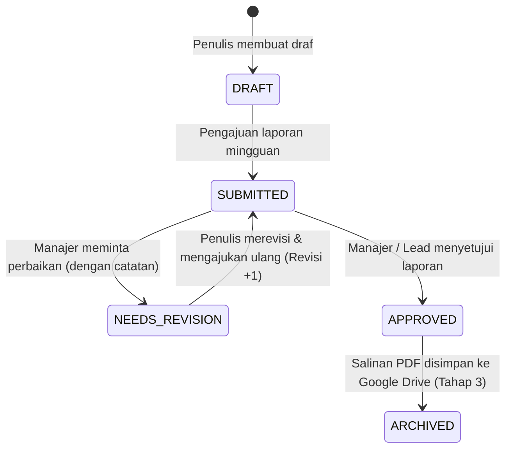

# Onewill Academy — The 4 Table Weekly Progress Dashboard

> **"Your Strategic Learning & Growth Partner."**  
> Dasbor Pelaporan Progres Mingguan 4 Tabel untuk Onewill Academy, dirancang berdasarkan **PRD v1.1**.

---

## 📌 Ringkasan Produk (Product Overview)

**The 4 Table Weekly Progress Dashboard** adalah aplikasi pelaporan internal mingguan yang memfasilitasi komunikasi terstruktur dan transparan antara tim operasional, pimpinan divisi, dan manajemen eksekutif Onewill Academy. 

Aplikasi ini menyatukan empat pilar pelaporan kritis dalam matriks visual 2×2 (desktop) dan tata letak bertumpuk yang responsif (mobile):

1. **Capaian Pekan Lalu (Achievements)**: Hasil kerja terverifikasi, progres proyek, metrik pencapaian (target vs realisasi), dan tautan bukti (*evidence URL*).
2. **Kendala & Hambatan (Issues)**: Masalah operasional, tingkat keparahan (*Low, Medium, High, Critical*), PIC, dampak bisnis, dan langkah mitigasi aktif.
3. **Sasaran Pekan Depan (Next Objectives)**: Target terukur (*measurable outcome*), penanggung jawab, tenggat waktu, dan tingkat prioritas.
4. **Dukungan yang Dibutuhkan (Support Needed)**: Eskalasi kebutuhan (keputusan manajemen, anggaran, SDM, akses sistem), pihak yang dimintai, tenggat waktu, nominal (jika ada), dan konsekuensi bisnis bila tertunda.

---

## 🎨 Identitas Visual & Panduan Warna (Brand Guidelines)

Sesuai dengan **Onewill Academy Logo Color Guide**:

| Warna | Kode Hex | Peruntukan |
| :--- | :--- | :--- |
| **Deep Violet** | `#43105B` | Warna brand utama, header wordmark, navigasi primer |
| **Corporate Purple** | `#6C2AA6` | Tombol aksi primer, aksen fokus, kartu metrik |
| **Golden Amber** | `#EBA107` | Aksen lambang pertumbuhan (*growth arrow*), status perhatian |
| **Lavender Tint** | `#F4EFFA` | Latar belakang modul, selektor tab, chip aktif |
| **Ink Navy** | `#242038` | Teks isi dan tipografi data |

### Logo & Aset Grafis
- `/public/onewill-logo.svg`: Kunci logo resmi lengkap (*Emblem* + *Wordmark* + Tagline *"Your Strategic Learning & Growth Partner."*).
- `/public/onewill-mark.svg`: Monogram sirkular geometris dengan aksen emas (*favicon* dan ikon navbar).
- `/public/onewill-logo-horizontal.svg`: Versi horizontal untuk header lebar.

---

## 🔄 Alur Kerja & Siklus Dokumen (Report Lifecycle)

Dokumen laporan mengikuti siklus verifikasi berjenjang dengan prinsip **Segregasi Tugas (No Self-Approval)**:



### Aturan Kunci PRD v1.1:
1. **Prinsip Segregasi Tugas**: Penulis laporan **tidak dapat menyetujui laporannya sendiri** (tombol persetujuan dinonaktifkan otomatis bila `authorId === reviewerId`).
2. **Imutabilitas Versi Disetujui**: Laporan yang telah berstatus `APPROVED` bersifat *read-only*. Perubahan pasca-persetujuan hanya dapat dilakukan melalui pembuatan **Amendemen Baru** (nomor revisi naik ke `#2`, `#3`, dst.).
3. **Pemisahan Kegagalan Arsip**: Status pengarsipan ke Google Drive bersifat independen dari keabsahan persetujuan laporan di basis data.

---

## 👥 Matriks Peran Pengguna (Role-Based Access Control)

| Peran (Role) | Hak Akses Laporan | Hak Akses Peninjauan | Catatan Akses |
| :--- | :--- | :--- | :--- |
| **Super Admin** | Akses Penuh (Buat/Edit/Amendemen) | Seluruh Divisi (kecuali laporan pribadi) | Konfigurasi sistem global |
| **Admin** | Manajemen Pengguna & Divisi | Seluruh Divisi (kecuali laporan pribadi) | Kelola direktori staf |
| **Management** | Melihat Seluruh Laporan | Seluruh Divisi (kecuali laporan pribadi) | Pengesahan anggaran & eskalasi |
| **Team Lead** | Mengisi Laporan Divisi | Hanya Divisi Sendiri (kecuali laporan pribadi) | Penelaahan teknis internal tim |
| **Contributor** | Menyusun Draf & Mengajukan | Tidak Ada Hak Peninjauan | Pelaporan progres kerja tim |

---

## 💻 Struktur Berkas Proyek (Next.js App Router Target Architecture)

```text
├── public/
│   ├── onewill-logo.svg           # Logo resmi lengkap Onewill Academy
│   ├── onewill-mark.svg           # Lambang ikon monogram sirkular
│   └── onewill-logo-horizontal.svg# Logo versi horizontal
├── src/
│   ├── app/                       # Next.js App Router Routes
│   │   ├── admin/
│   │   │   ├── integrations/
│   │   │   │   └── page.tsx       # /admin/integrations (Drive Status Tahap 3)
│   │   │   └── users/
│   │   │       └── page.tsx       # /admin/users (Direktori pengguna & peran)
│   │   ├── dashboard/
│   │   │   └── page.tsx           # /dashboard (Ringkasan KPI & matriks laporan)
│   │   ├── reports/
│   │   │   ├── [id]/
│   │   │   │   ├── edit/
│   │   │   │   │   └── page.tsx   # /reports/[id]/edit (Editor amendemen)
│   │   │   │   └── page.tsx       # /reports/[id] (Detail baca-saja 2x2)
│   │   │   ├── new/
│   │   │   │   └── page.tsx       # /reports/new (Pembuatan laporan baru)
│   │   │   └── page.tsx           # /reports (Daftar & riwayat laporan)
│   │   ├── reviews/
│   │   │   └── page.tsx           # /reviews (Antrean persetujuan pimpinan)
│   │   ├── error.tsx              # Error boundary segmen rute
│   │   ├── global-error.tsx       # Error boundary global aplikasi
│   │   ├── globals.css            # Tailwind CSS v4 & token warna tema Onewill
│   │   ├── layout.tsx             # RootLayout (AuthProvider, Header, Footer)
│   │   ├── loading.tsx            # Loading indicator transisi rute
│   │   ├── not-found.tsx          # Tampilan 404 terdedikasi
│   │   └── page.tsx               # Root route (ringkasan eksekutif)
│   ├── components/
│   │   ├── editor/
│   │   │   ├── AchievementsSection.tsx # Seksi 1: Capaian Pekan Lalu
│   │   │   ├── IssuesSection.tsx       # Seksi 2: Kendala & Hambatan
│   │   │   ├── ObjectivesSection.tsx   # Seksi 3: Sasaran Pekan Depan
│   │   │   └── SupportSection.tsx      # Seksi 4: Dukungan yang Dibutuhkan
│   │   ├── layout/
│   │   │   ├── Footer.tsx         # Quiet corporate footer
│   │   │   └── Header.tsx         # Top Bar Contract (Next.js Link & navigation)
│   │   ├── DemoAuthModal.tsx      # Simulasi login & pemilih persona
│   │   ├── FourTableGrid.tsx      # Kontainer 2×2 matriks desktop & mobile
│   │   ├── MetricCard.tsx         # Kartu KPI eksekutif (Tabular figures)
│   │   └── StatusBadge.tsx        # Chip status berpasangan teks + ikon
│   ├── context/
│   │   └── AuthContext.tsx        # Penyedia sesi demo & helper hak akses (SSR-guarded)
│   ├── services/
│   │   └── reportRepository.ts    # Abstraksi repositori data (SSR-guarded adapter)
│   ├── types/
│   │   └── index.ts               # Definisi model TypeScript domain
│   ├── utils/
│   │   └── dateUtils.ts           # Perhitungan pekan ISO & format Indonesia (WIB)
│   ├── views/                     # Reusable domain page views
│   │   ├── AdminIntegrationsView.tsx
│   │   ├── AdminUsersView.tsx
│   │   ├── DashboardView.tsx
│   │   ├── ReportDetailView.tsx
│   │   ├── ReportEditorView.tsx
│   │   ├── ReportsListView.tsx
│   │   └── ReviewsQueueView.tsx
│   ├── App.tsx                    # Shell SPA alternatif
│   └── main.tsx                   # Titik masuk React 19
├── next.config.mjs                # Konfigurasi Next.js
├── postcss.config.mjs             # Konfigurasi PostCSS Tailwind
├── package.json                   # Dependensi & skrip eksekusi
└── tsconfig.json                  # Konfigurasi kompilasi TypeScript
```

---

## 🚀 Memulai Pengembangan Lokal (Getting Started)

### Prasyarat
- Node.js `v20+` atau `v22+`
- npm atau bun

### Instalasi Dependensi
```bash
npm install
```

### Menjalankan Server Pengembangan (Dev Mode)
```bash
# Server Next.js App Router (Port 3000)
npm run dev:next

# Atau server Vite SPA (Port 3000)
npm run dev
```

### Validasi Kode & Pengetikan Statis
```bash
# Validasi tipe TypeScript
npm run lint

# Kompilasi produksi Next.js App Router (Turbopack)
npm run build:next

# Kompilasi produksi Vite
npm run build
```

---

## 🔒 Status Prototipe & Batasan Demo (UI Demo Mode)

Aplikasi saat ini beroperasi pada **UI DEMO MODE**:
- **Simulasi Autentikasi**: Pergantian peran pengguna disediakan untuk mempermudah evaluasi alur kerja tanpa memerlukan akun Google Workspace aktif.
- **Penyimpanan Lokal**: Draf tersimpan di `localStorage` peramban. Belum ada panggilan jaringan ke server atau database eksternal.
- **Google Drive Snapshot**: Dinyatakan secara akurat sebagai **"Belum Terhubung — Direncanakan Tahap 3"**. Login Google karyawan tidak memberikan otorisasi otomatis ke Google Drive perusahaan.

---

## 📋 Daftar Periksa Migrasi ke Produksi (Next.js & Firebase)

| Komponen | Status Saat Ini | Rencana Migrasi Produksi |
| :--- | :--- | :--- |
| **Framework** | Vite + React 19 SPA | Migrasi ke **Next.js App Router** (`app/(dashboard)/...`) |
| **Database** | `ReportRepository` (LocalStorage) | Hubungkan `ReportRepository` ke **Firebase Firestore SDK** |
| **Keamanan** | Logika sisi klien | Enforce aturan keamanan di `firestore.rules` berbasis `request.auth.uid` |
| **Autentikasi** | Simulasi pemilih peran | **Firebase Authentication** dengan Google Workspace SSO |
| **Arsip Drive** | Simulasi snapshot | Cloud Functions / Server Action dengan Google Drive API Scoped OAuth |
| **Validasi Skema** | TypeScript + Client checks | Validasi payload server menggunakan **Zod** |

---

## 📄 Lisensi
Hak Cipta © 2026 **Onewill Academy**. Hak cipta dilindungi undang-undang.
