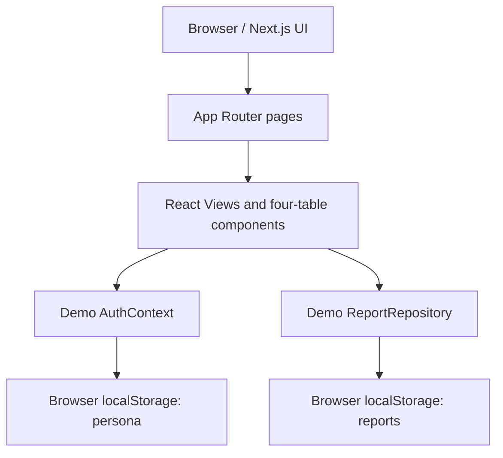
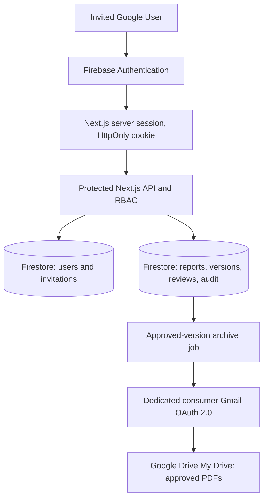

# Onewill Academy | Technical Architecture

**Documentation date:** 2026-10-08  
**Verified application commit:** [`273993d1cb7df2471fcbbe430de4954dcc8fd293`](https://github.com/onewillacademyid/onewill-4table-dashboard/commit/273993d1cb7df2471fcbbe430de4954dcc8fd293)

> Current implementation and target architecture are distinct. Anything under **TARGET** is a plan, not a claim of deployment.

## CURRENT: verified source architecture (M2)

- Next.js App Router pages under `src/app/` with `src/app/layout.tsx`; dashboard and editor views remain client-interactive.
- React 19, TypeScript, Tailwind CSS 4; `src/components/FourTableGrid.tsx` composes achievement, issue, objective and support sections in a responsive 2×2 layout.
- `src/context/AuthContext.tsx` exposes demo persona selection, and client-side permission helpers. This is not production authentication.
- `src/services/reportRepository.ts` provides sample users, teams, reports, KPI computations and localStorage-backed transitions. This is not a secure database.
- `src/types/index.ts` defines UserRole, WeeklyReport, structured items, review history, filters and dashboard metrics.
- `src/views/ReviewsQueueView.tsx` and report details simulate reviews/approval in the browser.
- `src/views/AdminIntegrationsView.tsx` labels Google Drive unconnected/planned. No live archive should be inferred.
- Build scripts: `npm run build:next` for Next.js; default `npm run build` is Vite. Local production build not independently run for this document.

### Key limitations
1. Demo role spoofing via `switchUser`/localStorage; no verified Firebase session or user registry.
2. All browser-side report actions lack backend-enforced authorization.
3. `updateReport` permits generic mutable fields and amended approvals have no immutable content snapshots.
4. Editor autosave status is timer-driven rather than confirmed persistence.
5. KPI calculations reference a hardcoded date and a static demo team count.

## TARGET: production architecture (PRD v1.1)

### Identity and authorization (M3)
- Google Sign-In and Firebase Email Link Passwordless prove identity; explicit invited and active user registry grants access. Bind accepted invitation to verified UID; enforce teams, roles, ownership and reviewer assignment on every privileged endpoint.
- Firebase Admin SDK and session-cookies are **server-only**; use HttpOnly, Secure in HTTPS, SameSite and CSRF/origin checks.
- No automatic first-login Super Admin. Bootstrap via one-time controlled operator procedure.
- Firestore user and invitation records are established in M3; report collection remains demo until 1B.

### Reporting and governance (1B / Phase 2)
- Server-validated schemas and repository adapter; Firestore is canonical report storage; use server timestamps and authorization checks.
- Approved reports persisted as immutable `report_versions` snapshots; amendment must create a new version, never mutate a prior approved snapshot.
- Review transitions require eligible, assigned reviewer, source status check, no self-approval and auditable event.
- Autosave shows success only after backend acknowledgment; failure surfaces clearly.
- Management KPIs derive from actual roster/reporting periods and WIB clock, not hardcoded examples.

### Gmail Drive archive (Phase 3)
- Onewill-controlled **consumer Gmail My Drive** is archive owner; no Workspace requirement and no service-account impersonation.
- Dedicated Google Drive OAuth consent, separate from staff Google Sign-In; prefer `drive.file` scope and app-managed archive folder.
- Store encrypted token through server secret management; no browser exposure. Generate PDFs from immutable approved versions, with idempotency and retry queues. Archive failure must not reverse approval.

### Security and operations
- Deny unauthorized direct Firestore access; apply least privilege at backend and database rules.
- Keep OAuth and application secrets outside Git and client bundles; least-privileged runtime service identity.
- Audit trail, backups, revoked user handling, monitoring and retention policy required before rollout.
- Production infrastructure target: Firebase App Hosting or Cloud Run subject to environment, operational and cost review.

## Architectural decisions pending confirmation
- Reviewer assignment policy, weekly submission cutoff, draft visibility and financial support access.
- Initial Super Admin owner and emergency recovery process (configured securely, not in public docs).
- Reporting volume, Firestore indexing, archive retention and export format.

## References
- [PRD v1.1](PRD_v1.1.md)
- [Migration plan](MIGRATION_PLAN.md)
- [Development status](DEVELOPMENT_STATUS.md)
